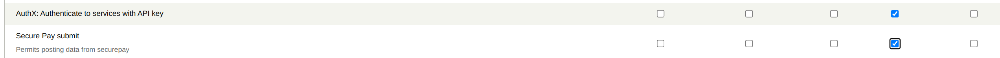

# columbia_securepay

Internal Columbia communication with internal Secure Pay

The extension supplies an end point to receive notifications from the Columbia Secure pay
system and process them into CiviCRM.

When a payment is received it is logged in the civicrm_system_log table in the first instance
and then records are created in the civicrm_secure_pay table. The first is primarily for debugging
and can be accessed through the api explorer (Support->Administrator->Api3 Explorer). It keeps a track of any raw information
that is sent in from the Columbia Secure pay server. The point of logging the data here
is that with minimal processing anything that is received would wind up in this table,
even if there were an error later in the process.

Once logged the data is processed into the civicrm_secure_pay table - these rows can be
seen in Contributions/Secure Pay and are in a more readable format. The table shows
both the Order status (e.g was the credit card accepted) and the Processing status - has the row
been processed into CiviCRM. In general the Processing Status will be 'Completed' and
there will be a contribution ID in the contribution ID column - indicating it has
been processed. As with accessing the System log - this table would normally only be checked
to ensure things are going correctly as the end result is the contribution is in CiviCRM.

## Requirements

* PHP v7.2+
* CiviCRM 5.49+

## Upgrading
Generally when upgrading CiviCRM there are no special actions that need to be taken for
this extension - although it is wise to keep an eye that Secure Pay transations
are still getting through to CiviCRM afterwards.

## Installation (Web UI)

Learn more about installing CiviCRM extensions in the [CiviCRM Sysadmin Guide](https://docs.civicrm.org/sysadmin/en/latest/customize/extensions/).

## Installation (CLI, Zip)

Sysadmins and developers may download the `.zip` file for this extension and
install it with the command-line tool [cv](https://github.com/civicrm/cv).

```bash
cd <extension-dir>
cv dl columbia_securepay@https://github.com/FIXME/columbia_securepay/archive/master.zip
```

## Installation (CLI, Git)

Sysadmins and developers may clone the [Git](https://en.wikipedia.org/wiki/Git) repo for this extension and
install it with the command-line tool [cv](https://github.com/civicrm/cv).

```bash
git clone https://github.com/FIXME/columbia_securepay.git
cv en columbia_securepay
```

## Getting Started

- Create a user for communications. The user must have these  permissions:
- permission AuthX: Authenticate to services with API key &
- Secure Pay submit (post_securepay)
- The contact associated with the user must have an api_key (in the table database as civicrm_contact.api_key)



The remote site will need to know
- the url - something like https://{siteName}/civicrm/ajax/api4/Securepay/submit`
- the api key
- the site key - this is the value referred to as encryptionKey in test.php

The [Sample code](test.php) demonstrates a php version of how the remote site
could interact.


